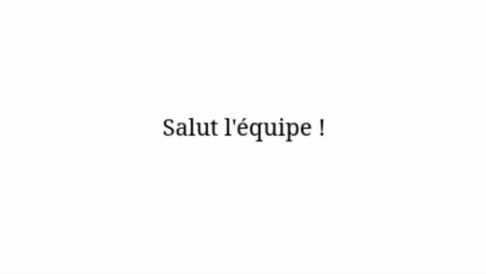

#cours #code

## **Introduction**
### **Qu'est-ce que Javascript ?**
- Un script est une séquence d'instructions qui s'exécutent les unes à la suite des autres
- Javascript permet de rendre les pages web "vivantes" ou "interactives".
	- Changer le [[1. HTML]] ou les [[2. CSS]]
	- Réagir aux actions de l'utilisateur
	- Envoyer des requêtes au serveur
- Langage du front (client), en opposition au PHP, langage du back (serveur).
> **Attention** à ne pas confondre le langage Java, pensé pour être embarqué sur des systèmes, et le langage Javascript, essentiellement exécuté dans le navigateur. Ils n'ont pas la même syntaxe et n'ont rien à voir sauf le nom.

### **Pourquoi apprendre le code en tant que graphiste ?**
- Savoirs qui s'appliquent dans tous les outils numériques (scripts Photoshop, traitement d'images en lot, automatisation de tâches...)
- Autonomie dans le prototypage de produits numériques
- Le code est un médium de création au même titre que la photo ou la peinture (code créatif)
- Mieux collaborer avec des développeurs (savoir ce qui est possible ou non, simple ou non)
- Créez et modifier vos outils selon vos besoins
- Ajouter une corde à son arc pour être plus attractif sur le marché du travail ou autonome en indépendant


<details>

<summary>Tips for collapsed sections</summary>

### You can add a header

You can add text within a collapsed section.

You can add an image or a code block, too.

```ruby
   puts "Hello World"
```

</details>

### **Ajouter un script à son projet web**
- Inline dans les balises HTML (à éviter)
```html
<button onclick="alert('Bonjour !')">Clique-moi</button>
```

- Balise `<script>` (à éviter)
```html
<script>
	document.querySelector("button")
	.addEventListener("click", function() {
		alert("Bonjour !");
	});
</script>
```
- Dans un fichier externe (bonne pratique)
```html
<script src="script.js"></script>
```

On peut ajouter un `<script>` dans le `<head>` à la manière d'un `<style>` pour les CSS mais ça pose le problème que le script s'exécute avant que la page ne soit chargée.

Pour pallier à ce problème on le place à la fin du `<body>` pour que le script s'exécute après le chargement des éléments de la page.
### **Exemples d'utilisation**

- Changer aléatoirement la couleur d'un élément au clic
```js
document.querySelector("div")
.addEventListener("click", function() {
	this.style.backgroundColor = 
	"#"+Math.floor(Math.random()*16777215).toString(16); 
});
```


- Créer un effet parallax sur un élément
```js
document.addEventListener("mousemove", function(event) {
	document.querySelector("img").style.transform = 
	`translate(
		${event.clientX / 10}px, ${event.clientY / 10}px
	)`; 
	// event.clientX et Y sont les positions X/Y de la souris
});
```


- Faire apparaître un texte progressivement
```js
let text = "Salut l'équipe !";
let i = 0;
function typeWriter() {
	if (i < text.length) {
		document.querySelector("p").innerHTML += text.charAt(i); i++;
		setTimeout(typeWriter, 100);
	}
}
typeWriter();
```

## **Techniques de développement fondamentales**

### **Variables**
Une variable sert à stocker une valeur.
```js
let couleur = "bleu"; // Déclare une variable
const pi = 3.14;      // Valeur qui ne change pas
```

| Type de donnée  | Exemple                                                         | Utilisation                      |
| --------------- | --------------------------------------------------------------- | -------------------------------- |
| Nombre          | `let x = 42`                                                    | Stocker des valeurs numériques   |
| Texte (string)  | `let nom = "Valentin"`                                          | Stocker du texte                 |
| Booléen         | `let isOpen = true`                                             | Valeur vraie ou fausse           |
| Tableau (array) | `let couleurs = ["rouge", "vert", "bleu"]`                      | Liste de valeurs                 |
| Objet           | `let personne = {nom: "Valentin", prenom: "Le Moign", age: 27}` | Regrouper plusieurs informations |

Bonnes pratiques pour nommer des variables :
- camelCase (menuBurger, isAllowed...)
- éviter les abréviations (mainBrandColor pas mbc)
- être pertinent (pas valeur ou data)
### **Fonctions**
Une fonction est un bloc de code qu'on peut appeler plusieurs fois.
```js
function direBonjour(prenom, nom) {
	console.log("Bonjour " + prenom + nom + " !");
}
direBonjour("Valentin", "Le Moign");
// Affiche "Bonjour Valentin Le Moign!"
```

### **Conditions**
```js
const currentTime = new Date().getHours();
if (currentTime >= 21) {
	document.body.style.backgroundColor = "blue";
} else if (currentTime === 12) {
	document.body.style.backgroundColor = "orange";
} else {
	document.body.style.backgroundColor = "yellow";
}
```
- Supérieur / inférieur à `>` `<`
- Supérieur / inférieur ou égal `>=` `<=`
- Égalité `===` (`==` ne compare pas le type)
- Différent `!==`

On peut aussi utiliser des opérateurs logiques
- `||` ou (`true || false` renvoie `true`)
- `&&` et (`true && false` renvoie `false`)
### **Boucles**

```js
let domElements = document.querySelectorAll('div');
for (let i = 0; i < domElements.length; i++) {
	domElements[i].style.transform = `translateY(${i * 10}px)`;
}
```
- On initialise avec `let i = 0`
- Tant que la condition n'est pas rempli `i < domElements.length`
- On exécute l'action `{ ... }`
- Et on modifie la valeur initiale `i++`
 ### **Débogage**
 Dans le navigateur, `ctrl + maj + i` ouvre les outils de développement. Dans l'onglet `Console` on trouve la console de Javascript. On peut y faire afficher des données avec `console.log()`.
## **Interagir avec le DOM**
### **Qu'est-ce que le DOM**
Le DOM, Document Object Model, est une représentation en arbre d'une page web permettant à Javascript d'interagir avec les éléments de la page HTML.
```html
<body>
	<header>
		<h1>Bienvenue sur mon site</h1>
		<p id="presentation">J'adore Javascript !</p>
	</header>
	<main>
		<p class="lorem">Lorem ipsum dolor sit amet.</p>
		<p>Ut enim aeque doleamus animo.</p>
		<p>At etiam Athenis.</p>
	</main>
</body>
```

```
| body
──| header
	──| h1
	  | p (class="presentation")
──| main
	──| p (class="lorem")
	  | p
	  | p
```

### **Viser un élément du DOM**
On peut viser un élément selon son `tag`, son `id`, ses `classes` ou ses liens de parentés avec d'autres éléments. On utilise la même syntaxe qu'en [[2. CSS]].
```js
let titre = document.querySelector('h1');
let presentation = document.querySelector('#presentation');
let paragraph = document.querySelector('.lorem');
```
On peut ensuite interagir avec les éléments visés.
```js
titre.innerText = "Ce site est super !";
presentation.style.backgroundColor = "red";
console.log(paragraph.offsetWidth);
```
### **Viser plusieurs éléments**
Lorsque l'on vise plusieurs éléments ils sont stockés dans un `array`. Il faut ensuite itérer à travers cette liste pour leur appliquer des modifications.
```js
let paragraphs = document.querySelectorAll("p");
paragraphs.forEach(paragraph, () => {
	paragraph.style.backgroundColor = "yellow";
});
```
### **Créer un élément**
```js
let nouveauParagraphe = document.createElement("p");
nouveauParagraphe.innerText = "Texte ajouté avec JavaScript !";
document.body.appendChild(nouveauParagraphe);
```
### **Supprimer un élément**
```js
document.querySelector("p").remove();
```
### **Sélectionner des éléments par leurs liens de parenté**
```js
let parent = document.querySelector("main");
let children = parent.children;
let firstChild = parent.firstElementChild;
let lastChild = parent.lastElementChild;
let grandParent = parent.parentNode;
let ancestor = parent.closest("body");
// permet de remonter l’arborescence jusqu’à un parent spécifique.
```
```js
let element = document.querySelector(".element");
let suivant = element.nextElementSibling;
let precedent = element.previousElementSibling;
```
### **Modifier les attributs d’un élément**
## **Événements**
Les événements permettent d'exécuter une action lorsqu'un utilisateur interagit avec une page web.
### **Ajouter un événement à un élément**

```js
document.querySelector("h1")
.addEventListener("click", function() {
	this.innerText = "Cliqué !";
	// `this` fait référence à l'élément cliqué
 });
```
### **Principaux types d'événements**
| Type d'événement | Description                 |
| ---------------- | --------------------------- |
| `click`          | Clic sur un élément         |
| `dblclick`       | Double-clic                 |
| `mouseover`      | Survol avec la souris       |
| `mouseout`       | La souris sort de l'élément |
| `keydown`        | Touche du clavier enfoncée  |
| `keyup`          | Touche du clavier relâchée  |

### **Gérer les entrées clavier**
```js
document.addEventListener("keydown", function(event) {
	if (event.key === "MouseUp") {
		// fais quelque chose	
	} else if (even.key === "MouseDown") {
		// fais quelque chose d'autre
	}
});
```
## **Code créatif**
### **Dessiner pour le web**
#### **SVG**
Le SVG est un format d'images vectorielles, c'est à dire définies par des objets géométriques (cercle, courbe...), des attributs (couleur de remplissage, position...) et des transformations (rotation, échelle...). De fait, on peut le définir directement depuis le HTML et le CSS puis le manipuler avec Javascript.
```html
<svg width="200" height="200">
	<circle cx="100" cy="100" r="50" fill="blue"/>
</svg>
```
Les attributs `cx` et `cy` définissent la position du centre du cercle, l'argument `r` défini son rayon.
De cette manière on peut dessiner des formes primitives :
- `rectangle`
- `cercle`
- `ellipse`
- `line`
- `polygon`
- `polyline`

Pour définir un tracé on utilise l'élément `path` pour lequel l'attribut `d` définit la séquence des mouvements. Il faut imaginer une description d'étapes de dessins. Un ensemble de commandes et de coordonnées est utilisé :
- `M x y` Déplace le curseur
- `L x y` Trace une ligne
- `H x` et `V y` Tracent une ligne horizontale ou verticale
- `C x1 y1, x2 y2, x y` Courbe de Bézier à deux points de contrôles
- `S x1 y1, x y` Pour continuer une courbe 
- `Q x1 y1, x y` Courbe à un seul point de contrôle
- `A rx ry x-axis-rotation large-arc-flag sweep-flag x y` Arc
- `Z` Fermer un tracé

Lorsque l'on utilise ces commandes en majuscule on note des positions absolues dans la `viewBox`, lorsqu'on les notes en minuscules ce sont des positions relatives à celles du point précédent.

On peut ainsi écrire n'importe quelle forme en SVG. On peut aussi utiliser d'autres techniques comme des dégradés, des filtres, des motifs, des transformations...

Example d'une courbe de Bézier à deux points de contrôle :
```html
<svg height="400" width="450">
	<path d="
		M 100 350
		L 250 50
		C 350 50, 400 200, 350 350
		Z
	" stroke="red" stroke-width="4" fill="none" />
</svg>
```


#### **Canvas**
### **Animations**
#### **SetTimeout**
#### **Easings**
### **Les librairies Javascript**
Une librairie permet d'ajouter des nouvelles fonctionnalités ou de simplifier certaines démarches.
#### **Comment installer une librairie Javascript**
- Installation manuelle
```html
<!-- Installer la librairie dans un dossier du projet -->
<script scr="lib/librairie.js"></script>
```
- Utiliser un CDN (*Content Delivery Network*)
```html
<head>
	<script src="https://lien-vers-la-librairie.js"></script>
</head>
```
- Installation avec NPM (*Node Package Manager*)
```bash
# installer node.js puis initialiser le projet
npm init -y
```
```bash
npm install librairie
```
```js
// importer la librairie dans le js
import librairie from "librairie";
```
#### **Exemples de librairies Javascript**
- [P5.js](https://p5js.org/) Facile d'utilisation pour découvrir les bases du code créatif
- [GSAP](https://gsap.com/) Créer des animations complexes
- [Three.js](https://threejs.org/) Créer des scènes en 3D
- [Pixi.js](https://pixijs.com/) Moteur de jeu-vidéo
- [D3.js](https://d3js.org/) Pour la visualisation de données
- [Paged.js](https://pagedjs.org/) Mise en page imprimée en web
### **Références**
#### **Exemples de projets**
- [The Chaos Game](https://andrew.wang-hoyer.com/experiments/chaos-game/) Andrew Wang
- [Type Morpher](https://p5js.org/sketches/2225285/) Esteban Barco
	- [Tous les sketchs d'exemple P5](https://p5js.org/sketches)
- [Pixelator](https://szymkiewi.cz/lab/pixelator/) Bartosz Szymkiewicz
- [Panartis Conference Project](https://rndr.studio/projects/panartis-conference-project) Rndr Studio
- [Biennale de Chaumont 2021](https://dia.tv/project/chaumont-biennale/) Dia Studio
- [Kinetic ASCII Illustration](https://lenaweber.com/archives/205) Lena Weber
- [Image Nuage](https://image-nuage.com/) It's Our Playground & Superspace
- [63 Clouds](https://autopoies.is/collages/63clouds/) Chia Amisola
- [Fédération Française du paysage](https://chevalvert.fr/fr/projects/federation-francaise-du-paysage), Chevalvert
- [Identité générative Abissa](https://int.studio/works/abissa/), INT Studio
#### **Ressources**
- [The Coding Train](https://thecodingtrain.com/) Tutoriels pour débutants
- [Nature of Code](https://natureofcode.com/) Livre de Daniel Shiffman
- [Deconbatch](https://www.deconbatch.com/) Blog d'un codeur créatif japonais
- [Awesome Creative Coding](https://github.com/terkelg/awesome-creative-coding) Liste très riche de ressources liées au code créatif
- [Dwitter](https://www.dwitter.net/) Partage de créations JS canvas en moins de 140 caractères
- [Creative Applications](https://www.creativeapplications.net) Communauté et actualité de code créatif
- [Tim Rodënbroker](https://timrodenbroeker.de/) Professeur de code créatif
- [Design System International](https://designsystems.international/) Studio d'identités visuelles
- [Iterations](https://iterations.online/) Cycle de conférence autour du code créatif
- [Graphisme en France n°28 - Création, outils, recherche, 2022](https://www.cnap.fr/actualites/graphisme-en-france/revues/ndeg28-graphisme-en-france-creation-outils-recherche-2022)
- [Modern Javascript cheatsheet](https://www.cyanhall.com/cheatsheet/8.javascript-cheatsheet/)
